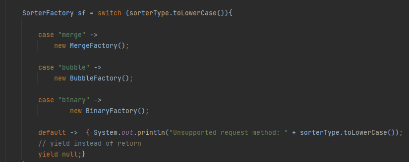
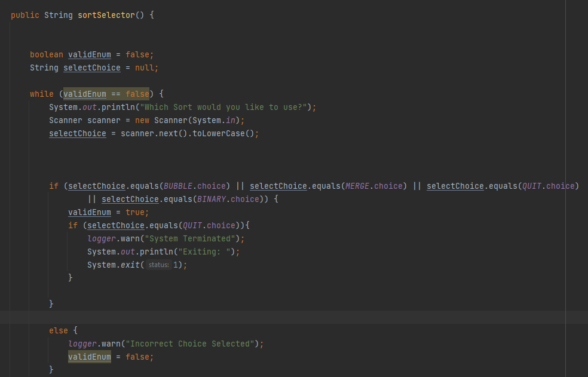
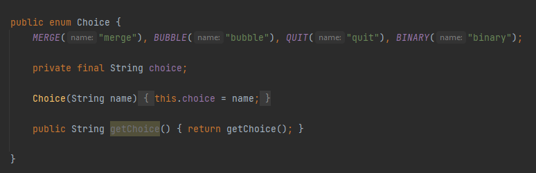

<h1 align="center">Sort Manager</h1>

  <p align="center">
    A program that allows for the sorting of arrays through Bubble, Merge and Binary Tree methods.
    <br />
  </p>
</div>


<!-- TABLE OF CONTENTS -->
<details>
  <summary>Table of Contents</summary>
  <ol>
    <li>
      <a href="#about-the-project">About The Project</a>
      <ul>
        <li><a href="#built-with">Built With</a></li>
      </ul>
    </li>
    <li>
      <a href="#getting-started">Getting Started</a>
      <ul>
        <li><a href="#prerequisites">Prerequisites</a></li>
        <li><a href="#installation">Installation</a></li>
      </ul>
    </li>
    <li><a href="#usage">Usage</a></li>
    <li><a href="#contact">Contact</a></li>
    <li><a href="#acknowledgments">Acknowledgments</a></li>
  </ol>
</details>


<!-- ABOUT THE PROJECT -->
## About The Project


This Project was developed and committed to over the span of a week. Night 4 and Day 5 of the Project experienced technical difficulties
due to the workstation involved having issues. Commits otherwise are consistent and accurately depict workflow.

This project intends to implement Bubble Sort, Merge Sort and Binary Tree Searching via the MVC structure. It will also allow users to select which searches they desire and allow them to compare performance times.


<p align="right">(<a href="#top">back to top</a>)</p>


### Built With

* [IntelliJ Community Edition](https://www.jetbrains.com/idea/)

### Implements

* Maven
* log4j

### Dependencies

* junit.jupiter Version 5.8.2
* apache.logging.log4j Version 2.17.1

<p align="right">(<a href="#top">back to top</a>)</p>

<!-- GETTING STARTED -->
## Getting Started

Simply run this project using IntelliJ Community Edition. Make sure to install the dependencies and implementations listead above.

### Installation

1. Clone the repository below.
   ```sh
   git clone https://github.com/AidenSykes1999/SpartaAiden.git
   ```
2. Either import or run the downloaded file onto IntelliJ Community Edition.


<p align="right">(<a href="#top">back to top</a>)</p>


<!-- USAGE EXAMPLES -->
## Usage


* <h3>Main</h3>

From the Main Class, you will be able to control this program. Your requests will be read in the Controller Area before being passed into the respective model.
Updates, Sent Data and Responses are managed by the View Area.


* <h3>Controller</h3>

The Controller will take your request and parse it into one of the available requests. At the moment this program supports 'Merge', 'Bubble' and 'Binary' commands as well as the option to 'Quit' the program.



Provided you enter a correct option, the program will then perform the appropriate function. For more information, please see the [Model] section.


* <h3>View</h3>

The View section of the project will provide you with updates and results. These updates include validation failures. For example, if you select a wrong choice the view will communicate with you.



This is accomplished by comparing your input to a catalogue of commands stored within the View.



* <h3>Model</h3>


<p align="right">(<a href="#top">back to top</a>)</p>


<!-- CONTACT -->
## Contact

Aiden Sykes - [Linked In](https://www.linkedin.com/in/aiden-sykes/) - asykes@spartaglobal.com

Project Link: [https://github.com/AidenSykes1999/SpartaAiden.git](https://github.com/AidenSykes1999/SpartaAiden.git)

<p align="right">(<a href="#top">back to top</a>)</p>


<!-- ACKNOWLEDGMENTS -->
## Acknowledgments

Thank you to the Training Staff at Sparta Global for teaching and assisting me during the development of my project.

* [Nishant Mandal]()
* [Paula Kendra]()
* [Neil Weightman]()

<p align="right">(<a href="#top">back to top</a>)</p>

