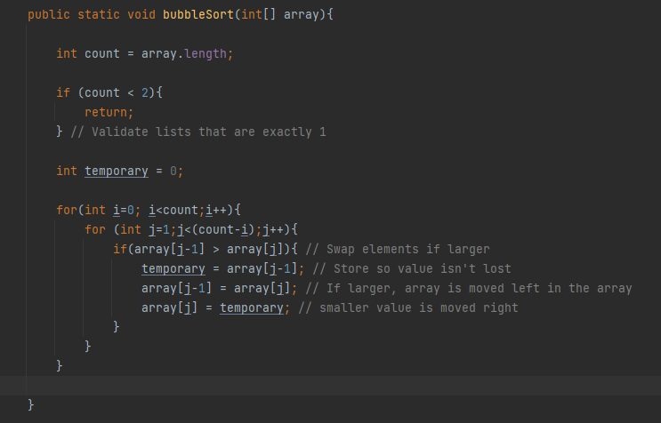
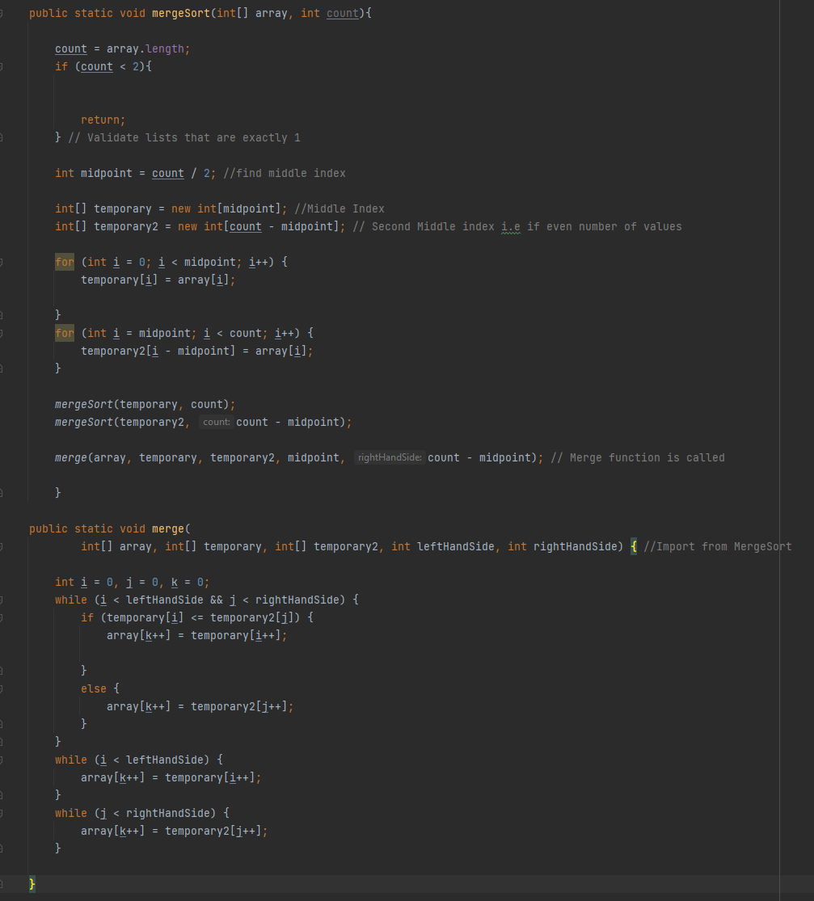
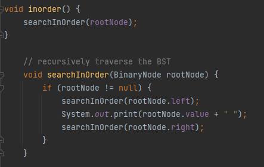
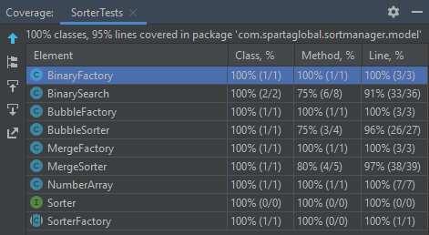

<h1 align="center">Sort Manager</h1>

  <p align="center">
    A program that allows for the sorting of arrays through Bubble, Merge and Binary Tree methods.
    <br />
  </p>


<!-- TABLE OF CONTENTS -->
<details>
  <summary>Table of Contents</summary>
  <ol>
    <li>
      <a href="#about-the-project">About The Project</a>
      <ul>
        <li><a href="#built-with">Built With</a></li>
      </ul>
    </li>
    <li>
      <a href="#getting-started">Getting Started</a>
      <ul>
        <li><a href="#prerequisites">Prerequisites</a></li>
        <li><a href="#installation">Installation</a></li>
      </ul>
    </li>
    <li><a href="#tour">Project Tour</a></li>
    <li><a href="#development">Development</a></li>
    <li><a href="#contact">Contact</a></li>
    <li><a href="#acknowledgments">Acknowledgments</a></li>
  </ol>
</details>


## About The Project


This Project was developed and committed to over the span of a week. Night 4 and Day 5 of the Project experienced technical difficulties
due to the workstation involved having issues. Commits otherwise are consistent and accurately depict workflow.

This project intends to implement Bubble Sort, Merge Sort and Binary Tree Searching via the MVC structure. It will also allow users to select which searches they desire and allow them to compare performance times.


<p align="right">(<a href="#top">back to top</a>)</p>


### Built With

* [IntelliJ Community Edition](https://www.jetbrains.com/idea/)

### Implements

* Maven
* log4j

### Dependencies

* junit.jupiter Version 5.8.2
* apache.logging.log4j Version 2.17.1

<p align="right">(<a href="#top">back to top</a>)</p>

## Getting Started

Simply run this project using IntelliJ Community Edition. Make sure to install the dependencies and implementations listead above.

### Installation

1. Clone the repository below.
   ```sh
   git clone https://github.com/AidenSykes1999/SpartaAiden.git
   ```
2. Either import or run the downloaded file onto IntelliJ Community Edition.


<p align="right">(<a href="#top">back to top</a>)</p>


## Project Tour


* <h3>Main</h3>

From the Main Class, you will be able to control this program. Your requests will be read in the Controller Area before being passed into the respective model.
Updates, Sent Data and Responses are managed by the View Area.


* <h3>Controller</h3>

The Controller will take your request and parse it into one of the available requests. At the moment this program supports 'Merge', 'Bubble' and 'Binary' commands as well as the option to 'Quit' the program.


Provided you enter a correct option, the program will then perform the appropriate function. For more information, please see the [Model] section.


* <h3>View</h3>

The View section of the project will provide you with updates and results. These updates include validation failures. For example, if you select a wrong choice the view will communicate with you.


This is accomplished by comparing your input to a catalogue of commands stored within the View.


* <h3>Model</h3>

The Model package of this project contains all of the methods and factories which sort and generate the arrays requested from the Controller.

The following sorting methods have fully integrated methods and factories:

- Bubble Sort

Will sort the array by comparing elements. If an element is larger than the element to the left of it, then the program will swap these values around until the array is fully in order.




- Merge Sort

Will split the array into two even chunks. These chunks are then split again and swapped around until they are in order. Once chunks are in order, they shall be merged again. The final product occurs when the last merge gives us a fully sorted array.





- Binary Tree Search

Converts each value into a 'Node'. Following from the first Node, known as the 'Root Node' the left-hand side of the node will contain the next smaller value whilst the right will contain the next larger value.

  - Uses an in-ordered search. Also returns duplicate values so that output is consistent with other arrays.




<p align="right">(<a href="#top">back to top</a>)</p>

## Development

### Phase 1

```

Write a program which will take an array of ints and sort it using a bubble sort algorithm and then a merge sort algorithm.
Include JUnit tests for this and all subsequent phases (and all subsequent projects for the rest of time).

```

Unlike the future phases, this phase didn't utilise the MVC structure learnt later within the week. Instead, it used 'SorterDriver' to call the sorting algorithms.

This meant that the project initially had no user interface and instead relied on the ability to run the program through the IDE.

Development for Phase 1 was fairly simple as it mostly covered algorithms that I had already learnt.

JUnit testing within this phase was rather simple, with extra functionality being added further along the development process.


### Phase 2

```
Update your project to use MVC and start to incorporate some of the design principles discussed earlier in the course (OOP, SOLID, design patterns).
Create classes which implements MVC, including SortManager (controller) and a DisplayManager (view) classes.
The code should include a basic factory pattern to determine which sorter to use.
Make sure packages are created properly and the structure follows the MVC pattern.
Create an interface which both sort classes can implement and make sure your application uses this interface where possible.

```

Incorporating MVC meant adding a Controller and Viewer to my project. This was fairly easy to implement due to the simplicity of ensuring that one class equates to a single purpose.

This is the reason that I have a class dedicated to generating random arrays; generating these arrays within each sorting algorithm would complicate the code.


### Phase 3

```

Add logging code into the Sort Manager project. Set up log4j in the project and add a properties file.
Create logs at different levels and fully test the resulting output.
Have output going to a log file created in the resources directory.
Ensure there are meaningful log messages added to the project and that they reflect the needs of the levels for which they are set.


```

Implementing logging code was a brand-new concept to me. As a result I could definitely expand upon this in the future. However, I do believe that the amount of logging that I added to my program is sufficient to keep a close eye on what is occuring within the program.

In the future I would also like to potentially implement the feature to save log files from within the program itself rather than having to do it manually via the File Explorer.


### Phase 4

```

Integrate a new class to implement a binary search tree approach for sorting, so that the BST can be called in the same way as the other sort algorithms.
The new class should implement the current Sorter interface.
Add code that calls the BST and passes in the array that will be used to construct the tree and then return a sorted array.
Use the Facade design pattern for this step and implement a nested class to represent a node in the tree.

```

There was a small gap in development between phases 3 and 4. This is because of technical difficulties which occured during Thursday Night (Day 4 of development.) Thankfully due to data redundancy, I was able to continue with the development of this project. In Day 5.

Developing the Binary Search Tree took more research than the previous tasks due to the relative complexity of the searching algorithm. Thankfully due to utilising the resources given to me by my trainers (See Acknowledgements) I was able to make headway with the implementation during Day 6.


There was a slight problem regarding the decision to include only Distinct values within the BST or not. I decided to include duplicate values because I followed the Principle of Least Astonishment; I believe that the average user would expect all of their array to be outputted rather than just distinct values.

### Phase 5

```

Add timing information to the project and allow the user to select multiple algorithms to compare their performance.

```

Timing implementation was relatively easy to implement, with me completing this phase within Night 6 and Day 7 of development.

This phase is also one that I might approach again in the future. This is because I believe that the looping system that I used could be improved upon.

I could also implement future features like the program outputting the type of method used coupled with the time result. One thing I would like to improve is the 'Quit' function. At the moment if you Quit midway through a sort, you will not access your prior time results.


### JUnit Testing

JUnit testing allows us to test the model methods of the project without having to participate in lengthy manual testing.

Effecient use of JUnit Tests will allow us to maintain our program to ensure that it works without any error.

We can find errors by asserting  results and comparing it to the actual result



As you can see, the JUnit tests that this program has a coverage of above 90% of the project's lines of code. With the outliers being code that doesn't affect overall performance.

<p align="right">(<a href="#top">back to top</a>)</p>

## Contact

Aiden Sykes - [Linked In](https://www.linkedin.com/in/aiden-sykes/) - asykes@spartaglobal.com

Project Link: [https://github.com/AidenSykes1999/SpartaAiden.git](https://github.com/AidenSykes1999/SpartaAiden.git)

<p align="right">(<a href="#top">back to top</a>)</p>


<!-- ACKNOWLEDGMENTS -->
## Acknowledgments

Thank you to the Training Staff at Sparta Global for teaching and assisting me during the development of my project.

* [Nishant Mandal]()
* [Paula Kendra]()
* [Neil Weightman]()

<p align="right">(<a href="#top">back to top</a>)</p>

